<<<<<<< HEAD
# Cloud Computing Lab – Lab 1

**Name:** Nimra Mursleen

**Reg No:** 2023-BSE-047

**Course:** Cloud Computing Lab

**Section:** V-B

**LAB-1**

## VMware Installation

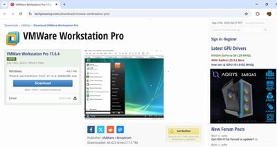

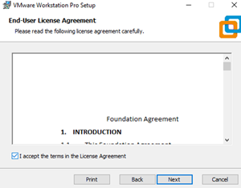

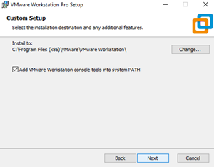

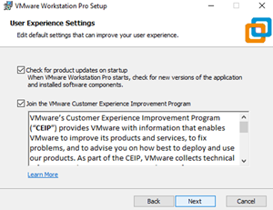

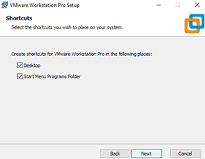

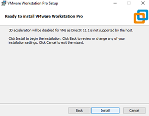

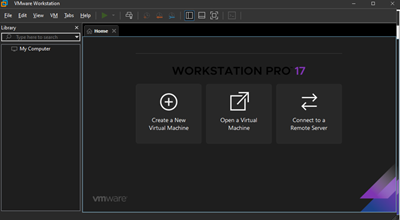

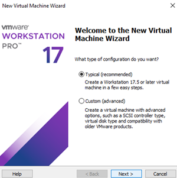

## Ubuntu Server Installation

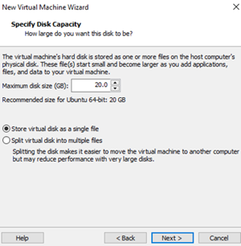

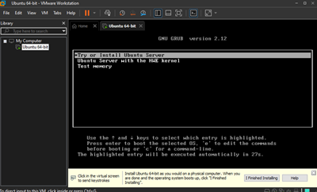

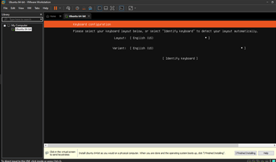

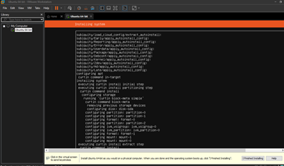

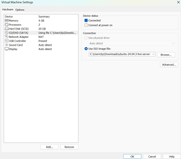

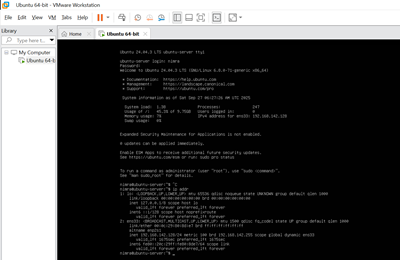

## Accessing Ubuntu Server from Windows

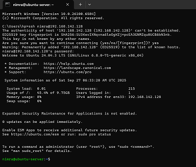
=======

