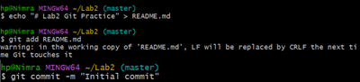
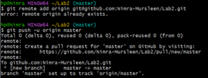
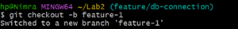
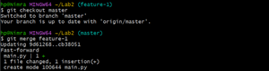
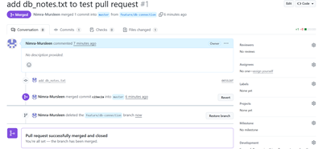
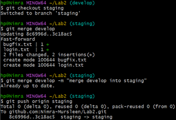

# Cloud Computing Lab – Lab 2

**Name:** Nimra Mursleen  
**Reg No:** 2023-BSE-47  
**Course:** Cloud Computing Lab  
**Section:** V-B  

**LAB-2**

## Install Git on your PC

---

## Task 1: Create Private GitHub Repository

---

## Task 2: Connect Repository via SSH

1. Generate a new SSH key  

2. Add SSH public key to GitHub  

3. Clone your Lab2 repo using SSH  

---

## Task 3: Configure Git Username and Email

1. Set up Git identity  

2. Verify configuration  

---

## Task 4: Explore the .git Folder

---

## Task 5: Local Repository Management

1. Delete the existing `.git` folder  

2. Re-initialize the local git repository  

3. Add a file named `README.md` and commit it  

4. Connect local repo to GitHub and push  

---

## Task 6: File Status & Staging

1. Create a new file `notes.txt`, write a note, and check status  

2. Stage and commit  

---

## Task 7: Branch Creation Using GitHub GUI

1. On GitHub, create a branch named `bugfix/user-auth-error`  

2. Pull the branch to local repository to sync  

---

## Task 8: Branch Creation and Push Using Git Bash

---

## Task 9: Branching & Merging

1. Create and switch to a branch `feature-1`  

2. Modify `main.py` (add a function) and commit  

3. Switch back to `master` and merge  

4. Push all branches  

---

## Task 10: Pull Request and Branch Review (GitHub GUI)

1. Pull Request creation  

2. Pull Request review and merge  

3. Branch deletion  

---

## Task 11: Detailed Branch Strategy (Develop/Staging)

1. Branch list  
   - Create `develop` and `staging` branch  
   

   - Create `feature/login` and `bugfix/error-msg` branch in `develop`  

2. Merges into `develop` and `staging`  

3. Final merge into `master`  

